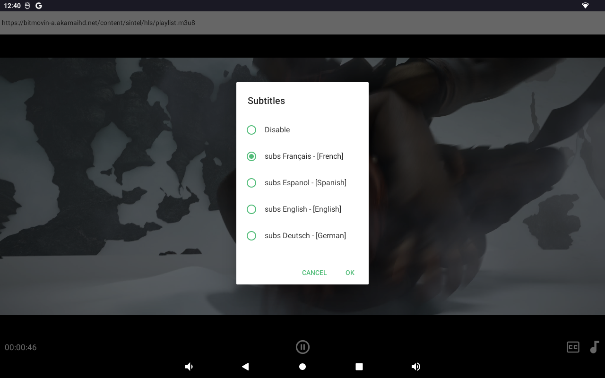

<h1 align="center">⚛ React Native IPTV with VLC ⚛</h1>

<p align="center"> 
  <a href='#-intro'><b>Introduction</b></a> 
    &nbsp;&nbsp;—&nbsp;&nbsp; <a href="#-tools"><b>Tools</b></a> 
    &nbsp;&nbsp;—&nbsp;&nbsp; <a href="#-getting-started"><b>Usage</b></a> 
</p>
  
</br>

---

## 👋 Intro

React Native IPTV Demo App with VLC

VLC library used for this priject : [react-native-vlc-media-player](https://github.com/AppGambitStudio/react-native-vlc-media-player)

Test URL : [https://bitmovin-a.akamaihd.net/content/sintel/hls/playlist.m3u8](https://bitmovin-a.akamaihd.net/content/sintel/hls/playlist.m3u8)

---

## 🧰 Tools

This project is using following common tools:

- **Redux Architecture**
  - [Redux](https://redux.js.org/)
  - [Redux ToolKit](https://redux-toolkit.js.org/)

* **Routing and navigation**
  - [React Navigation v6](https://reactnavigation.org/)

- **Data Caching / Offline**
  - [Redux Persist](https://github.com/rt2zz/redux-persist#readme)

* **Logger**
  - [Redux Logger](https://github.com/LogRocket/redux-logger#readme)

---

## 🚀 Getting Started

- Add `eslint`, `prettier` and `editor config` plugins into your IDE
- Your machine must have [React Native dependencies](https://reactnative.dev/docs/environment-setup) installed

#### Install dependencies

```
yarn && npx pod-install ios
```

#### Android

```
npx react-native run-android
```

#### iOS

```
npx react-native run-ios
```

Or

```
Open project.xcworkspace file from ios folder and build from xcode
```

---

## 🚀 Screenshot





